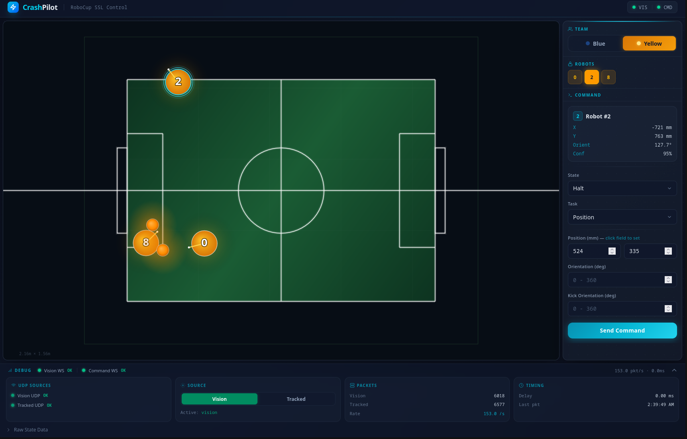

# CrashPilot Interface

<!-- badges -->
<!-- [](https://go.dev) -->
<!-- [](https://react.dev) -->
<!-- [](LICENSE) -->

A web-based interface for controlling and monitoring [RoboCup SSL](https://ssl.robocup.org/) robots. Select a team and robot, visualize the field in real time, and send commands -- all from your browser.



## Features

- **Live field visualization** -- canvas-based rendering of field lines, arcs, robots (blue/yellow), and balls
- **Dual vision source** -- receive SSL Vision raw packets *or* tracked packets via UDP multicast, switchable at runtime
- **Robot command builder** -- select a team and robot, choose a state (`Halt`, `Stop`, `Free`, `Goalie`) and task (`Position`, `Kick`, `Chip`, `Dribble`, etc.), then send commands over WebSocket
- **Protobuf transport** -- commands follow the `CP_Interface` schema and are serialized with Protocol Buffers
- **Command forwarding** -- optionally forward commands to a robot gateway over UDP or TCP
- **Debug panel** -- packet info, round-trip delay, and connection status at a glance
- **Single binary deployment** -- the Go backend embeds the compiled React frontend; one binary is all you need
- **Configurable** -- all network addresses and options live in `config.toml`

## Architecture

```
 SSL Vision                                        Browser
 (multicast)                                    (React + Tailwind)
     |                                               ^
     | UDP                                           | WebSocket
     v                                               v
+-----------+      +-------------+      +------------------------+
|  Vision   | ---> |     Hub     | ---> |  Fiber HTTP / WS       |
|  Listener |      | (fan-out)   |      |  Server                |
+-----------+      +-------------+      +------------------------+
                         |                       |
                         |                       | protobuf
                         v                       v
                   +--------------+      +-----------------+
                   | Debug stats  |      | Command Target  |
                   | (delay, pps) |      | (robot gateway) |
                   +--------------+      +-----------------+
```

**Data flow:**

1. The vision listener joins the SSL Vision multicast group and decodes protobuf packets (raw or tracked).
2. Decoded frames are fanned out through the hub to every connected WebSocket client.
3. The React frontend draws robots, balls, and field geometry onto an HTML canvas.
4. The user builds a command in the UI; it is serialized as a `CP_Interface` protobuf message and sent back over the WebSocket.
5. The server optionally forwards the command to a configured robot gateway.

## Prerequisites

| Tool    | Version              |
|---------|----------------------|
| Go      | 1.26+                |
| Node.js | 18+                  |
| npm     | (comes with Node.js) |

## Quick Start

```bash
# Clone the repository
git clone https://github.com/technulgy-lgnu/crashpilot-interface.git
cd crashpilot-interface

# Build the single binary (frontend + backend)
make build

# Edit configuration (see Configuration section below)
$EDITOR config.toml

# Run
./crashpilot-interface
```

Then open <http://localhost:8080> in your browser.

## Configuration

All settings live in `config.toml` at the project root.

```toml
[server]
host = "0.0.0.0"
port = 8080

[vision]
multicast_addr  = "224.5.23.2:10006"
multicast_iface = ""
tracked_addr    = "224.5.23.2:10010"
default_source  = "vision"

[command_target]
host     = ""
port     = 0
protocol = "udp"
```

### `[server]`

| Key    | Default   | Description                                   |
|--------|-----------|-----------------------------------------------|
| `host` | `0.0.0.0` | Address the HTTP/WebSocket server listens on. |
| `port` | `8080`    | Port the server listens on.                   |

### `[vision]`

| Key               | Default              | Description                                                                                               |
|-------------------|----------------------|-----------------------------------------------------------------------------------------------------------|
| `multicast_addr`  | `224.5.23.2:10006`   | SSL Vision raw multicast address and port.                                                                |
| `multicast_iface` | `""` (default iface) | Network interface to join the multicast group on. Leave empty to use the OS default.                      |
| `tracked_addr`    | `224.5.23.2:10010`   | SSL Vision tracked packet multicast address and port.                                                     |
| `default_source`  | `"vision"`           | Initial vision source on startup: `"vision"` (raw) or `"tracked"`. Can be changed at runtime from the UI. |

### `[command_target]`

| Key        | Default | Description                                                                                                      |
|------------|---------|------------------------------------------------------------------------------------------------------------------|
| `host`     | `""`    | Hostname or IP of the robot gateway to forward commands to. Leave empty to only log commands without forwarding. |
| `port`     | `0`     | Port of the robot gateway.                                                                                       |
| `protocol` | `"udp"` | Transport protocol: `"udp"` or `"tcp"`.                                                                          |

## Development

Run the frontend dev server and the Go backend separately for a faster feedback loop.

**Frontend** (hot-reload via Vite):

```bash
cd frontend
npm install
npm run dev
```

The Vite dev server starts on <http://localhost:5173> by default and proxies API/WebSocket requests to the Go backend.

**Backend:**

```bash
go run ./cmd/server
```

The backend serves on the port configured in `config.toml` (default `8080`).

## Building

```bash
make build
```

This will:

1. Install frontend dependencies and run `npm run build` (TypeScript check + Vite production build into `frontend/dist`).
2. Build the Go binary with the frontend assets embedded, producing a single self-contained executable.

The output binary is `crashpilot-interface` in the project root.

## Protocol

CrashPilot Interface uses [Protocol Buffers](https://protobuf.dev/) (proto2) for all structured data. The key messages are defined under `proto/crashpilot/`:

### `CP_Interface` (`proto/crashpilot/interface/cp_interface.proto`)

Top-level message sent from the UI to the backend. Contains a `robot_id` and a `CP_Command`.

### `CP_Command` (`proto/crashpilot/cp_robot/cp_cp_robot.proto`)

Describes what a robot should do:

- **`CP_State`** -- the robot's operating mode: `Halt`, `Stop`, `Free`, or `Goalie`.
- **`CP_Task`** -- the action to perform: `Position`, `Kick`, `Chip`, `ReceiveKick`, `Steal`, `Dribble`, `PositionBall`, `ReceiveBall`, `Kickoff`, `BallPlacement`, or `FreeKick`.
- Optional fields for target position (`pos`), orientation, and kick orientation.

### SSL Vision messages (`proto/vision_tracked/`)

Standard RoboCup SSL protobuf definitions for raw detection frames (`SSL_WrapperPacket`) and tracked frames (`TrackerWrapperPacket`).

Proto stubs are generated with [buf](https://buf.build/) into `gen/proto/` (see `buf.gen.yaml`).

## License

This project is licensed under the MIT License. See the [LICENSE](LICENSE) file for details.
